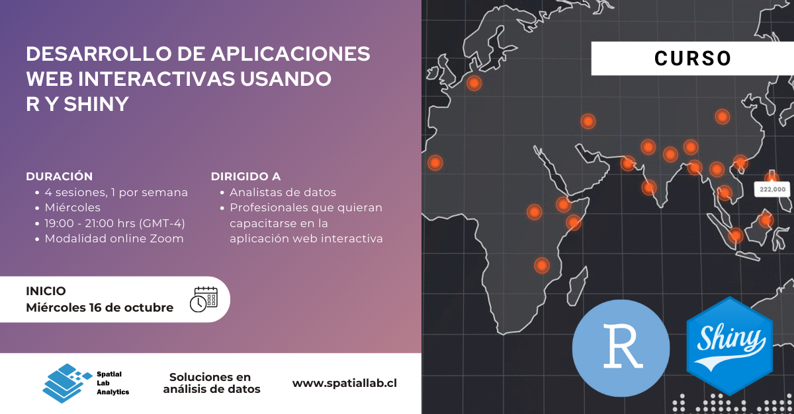

# Desarrollo de aplicaciones web interactivas con R y Shiny (versión 1)

_Desde el 16 de octubre al 6 de noviembre, 2024._

Docente: _Bastián Olea Herrera._ baolea@uc.cl

Repositorio con los materiales y las clases de la versión 1 del curso, impartida en [SpatialLab.](http://spatiallab.cl)

En [SpatialLab encontrarás muchos más cursos](https://spatiallab.cl/cursos-1) sobre R y análisis de datos impartidos por profesionales de diversas áreas.

Para más información sobre mis próximos cursos y clases particulares: [https://bastianolea.rbind.io/clases/](https://bastianolea.rbind.io/clases/)
